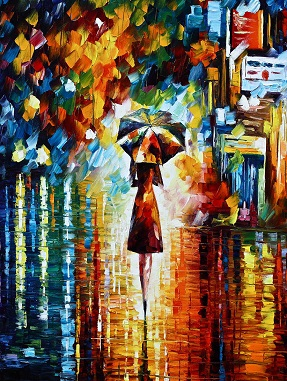
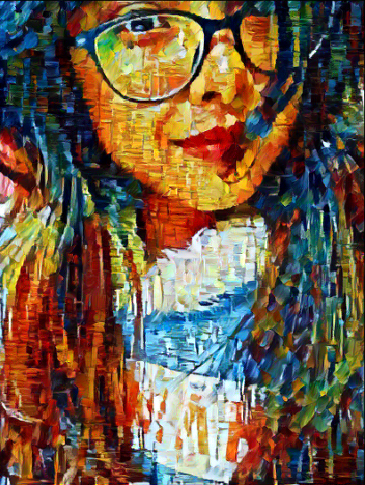
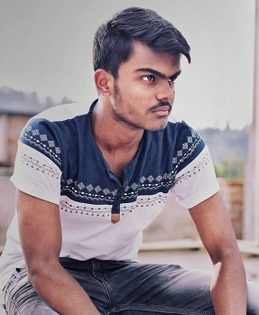
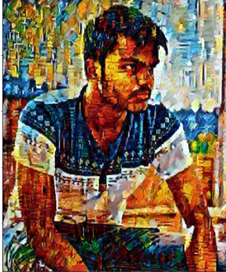

# Neural-Style-Transfer

This is an implimentation of Neural Style Transfer in Pytorch. 

You can read more about Neural Style Transfer from the following links :
https://www.tensorflow.org/tutorials/generative/style_transfer

https://medium.com/tensorflow/neural-style-transfer-creating-art-with-deep-learning-using-tf-keras-and-eager-execution-7d541ac31398

# Implimentation
You can run the file style_transfer1.ipynb in your system, but your system should be GPU enabled for fast process or you can run it in Google Colab for best results.
Change the Image Path and Style path with your own image and style and view the results.

# Example

## Input 1

   

### Result after 9000 iterations 

### Input 2

  

### Result after 9000 iterations

